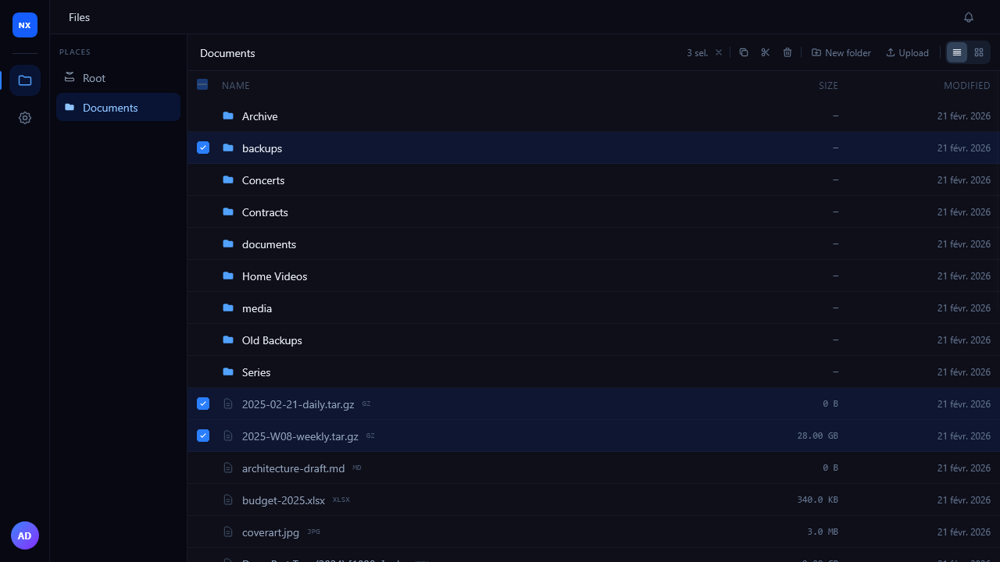
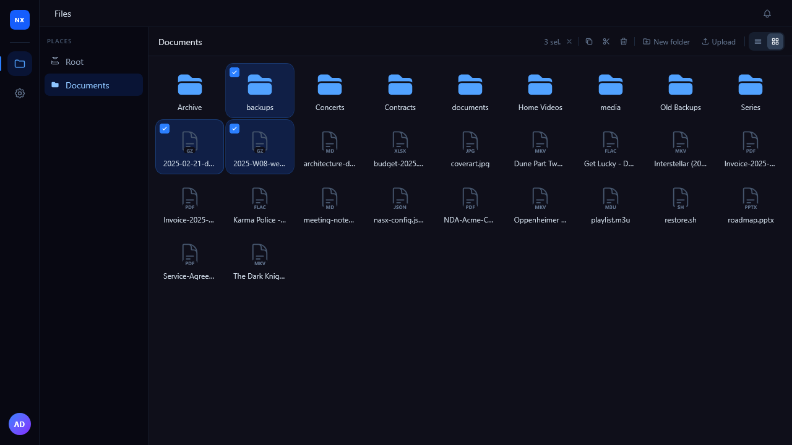

# NASX

> [!WARNING]
> **Early stage software.** NASX is under active development and has not been audited for security. It may contain vulnerabilities, incomplete features, or breaking changes without notice. Use at your own risk, preferably on an isolated network.
> Tested on **Ubuntu 24.04** only. Other distributions are not officially supported.

A self-hosted NAS dashboard — browse, upload, download and manage files on your Linux server from any browser.

---



---

## Features

### File browser
- Navigate folders, rename, move, copy, delete files and directories
- Drag-and-drop or picker upload with chunked transfer and live **MB/s throughput** display
- Pause, resume or cancel uploads mid-flight
- Click the throughput badge to switch to chunk count display
- One-click download

| List view | Grid view |
|---|---|
|  |  |


### Places
Administrators define **Places** — named mount points that map a server path to a share visible in the browser. Users only see the shares they have access to.

### Users & roles
- Create users with individual Linux account mapping for filesystem-level permission enforcement
- Assign roles; roles carry read/write permissions per Place
- Fine-grained per-user overrides on top of role permissions

### Async operations
Heavy operations (copy, move, assemble large uploads) run as background jobs executed by a privileged worker process. The UI polls for completion and notifies you when done — no browser tab needs to stay open.

### Privilege isolation
The backend runs as an unprivileged user. A separate **root worker** process communicates over NATS JetStream and performs privileged filesystem operations (ownership-preserving copies, `chmod`, `chown`, user-impersonated writes) in isolation. No `sudo` required at runtime.

---

## Requirements

- A Linux server (x86-64)
- `curl`, `openssl`
- Ports 80 (nginx, optional) and 9001 (backend) reachable from clients

---

## Install

```bash
curl -fsSL https://raw.githubusercontent.com/kittyruntime/nasx/main/scripts/install-release.sh | sudo bash
```

The script:
1. Creates a `nasx` system user
2. Installs Node.js 22 via nvm (in the `nasx` user's home)
3. Downloads and installs the [NATS](https://nats.io) message broker
4. Installs the `nasx-root-worker` privilege worker
5. Applies the database schema
6. Seeds an `admin / admin` account
7. Registers and starts three systemd services: `nasx-nats`, `nasx-root-worker`, `nasx`
8. Configures nginx if present

> **Change the admin password immediately after first login.**

### Update

Re-run the same command. The script detects an existing installation, preserves the database and all secrets, and restarts only the application services.

```bash
curl -fsSL https://raw.githubusercontent.com/kittyruntime/nasx/main/scripts/install-release.sh | sudo bash
```

### Pin a version

```bash
curl -fsSL ... | sudo VERSION=v1.2.0 bash
```

---

## Services

| Unit | Role |
|---|---|
| `nasx-nats` | NATS JetStream message broker |
| `nasx-root-worker` | Privileged filesystem worker (runs as root) |
| `nasx` | Backend API + static file server |

```bash
systemctl status nasx nasx-root-worker nasx-nats
journalctl -u nasx -f
```

---

## Build from source

Requirements: Node.js ≥ 18, pnpm, Go ≥ 1.21, curl, openssl.

```bash
git clone https://github.com/kittyruntime/nasx
cd nasx
sudo bash scripts/install.sh
```

---

## License

Free for personal, non-commercial use by private individuals.
Company and commercial use requires prior written agreement — see [LICENSE](LICENSE) for details.
